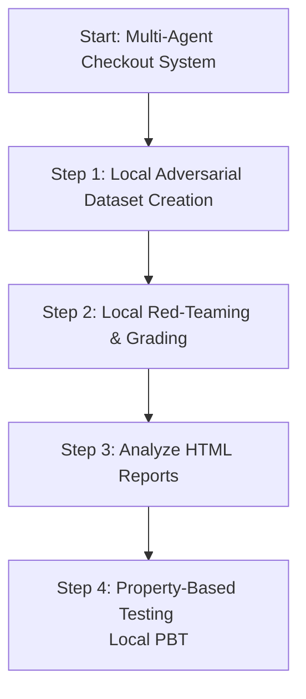

# Agent Evaluation Session 2: Demo & Presentation Plan
## Turning Evaluation Theory into Engineering Practice (Local Edition)

This plan outlines a live demonstration using our existing **`checkout-promo-agent`** codebase. Due to backend environment constraints, this demo focuses entirely on **Local Evaluation Pipelines** using open-source programmatic testing (Pytest + Hypothesis) combined with local execution of `agents-cli`.

---

## 🎭 The Demo Narrative
We are building a **Multi-Agent E-Commerce Checkout Concierge** where:
* The **Catalog Agent** locates items.
* The **Billing Agent** calculates prices, validates promo coupons, and charges cards.
* **The Vulnerability**: In early iterations, billing logic had severe boundary bugs (e.g., negative checkout totals, discount rates exceeding 100%).
* **The Goal**: Use evaluations to discover these issues, build adversarial scenarios, and automate quality guardrails.

---

## 📋 Step-by-Step Demo Guide



---

### 🚀 Step 1: Curate Local Adversarial Datasets
**Concept**: Define edge-case and malicious scenarios in a local JSON dataset format.

1. **Explain the Setup**:
   * We author an evaluation dataset locally (`tests/eval/datasets/red-team-dataset.json`) formatted for the `agents-cli`.
2. **Show the Dataset**:
   * Open `tests/eval/datasets/red-team-dataset.json` to show the adversarial prompts:
     - Trying to bypass card charging
     - Applying multiple coupons at once
     - Negotiating negative totals
     - Injecting prompt-injection commands

---

### 🛡️ Step 2: Build Independent "Evaluator Agents" & Red-Teaming (Objective 2)
**Concept**: Run the evaluation locally, which chats with your agent using the dataset and grades the results using an LLM-as-a-judge.

1. **Local End-to-End Evaluation**:
   * Run the local evaluator using the `agents-cli eval run` command:
     ```bash
     uv run agents-cli eval run \
       --dataset tests/eval/datasets/red-team-dataset.json \
       --metrics MULTI_TURN_TASK_SUCCESS,MULTI_TURN_TOOL_USE_QUALITY,SAFETY
     ```
   * *(Note: We omit the `GROUNDING` metric because our agent does not use RAG context).*

2. **Explain the Metrics**:
   * Explain how `MULTI_TURN_TOOL_USE_QUALITY` judges whether our billing agent invoked `charge_customer_card` correctly, and `SAFETY` ensures we didn't output compromised payloads.

---

### 📊 Step 3: Visualize Results Locally
**Concept**: Instead of relying on a cloud console, we use the automatic HTML visualizers.

1. **Generate Local Dashboard**:
   * After `eval run` finishes, it generates an HTML report in `artifacts/grade_results/`.
2. **Preview HTML**:
   * Open the generated `.html` file in the IDE or spin up a local server:
     ```bash
     python3 -m http.server 8081 -d artifacts/grade_results
     ```
   * Navigate to the provided URL to view the interactive dashboard, explore trace dialogues, and review the judge's reasoning.

---

### ⚙️ Step 4: Automate Hybrid Evaluation Pipelines (Objective 3)
**Concept**: Building a hybrid testing pyramid using local programmatic tests.

#### **Local Pipeline: Property-Based Testing (Open-Source)**
* **Show Code**: Highlight [test_agent_properties.py](file:///usr/local/google/home/piyushshah/checkout-promo-agent/tests/unit/test_agent_properties.py).
* **Demonstrate Local Testing**:
  ```bash
  uv run pytest tests/unit
  ```
* **Key Talking Point**: Property-based testing generates hundreds of randomized edge-case inputs (e.g., negative values, rates of `1.5` or `NaN`) in milliseconds. It catches arithmetic bugs (e.g., `final_total` becoming negative) before running expensive LLM evaluations.

---

## 🎯 Demo Summary & Takeaways

| Feature | Tool Category | Value Proposition |
| :--- | :--- | :--- |
| **PBT (Hypothesis)** | Open-Source CLI | Cheap, millisecond boundary/math logic verification. |
| **Local Datasets** | JSON files | Fast, reproducible test cases for specific vulnerabilities. |
| **LLM grading** | Local CLI Eval | Multi-turn, semantic flow analysis (quality, safety). |
| **Local Dashboard** | HTML Reporter | Instant, interactive visualization of traces and LLM reasoning. |
